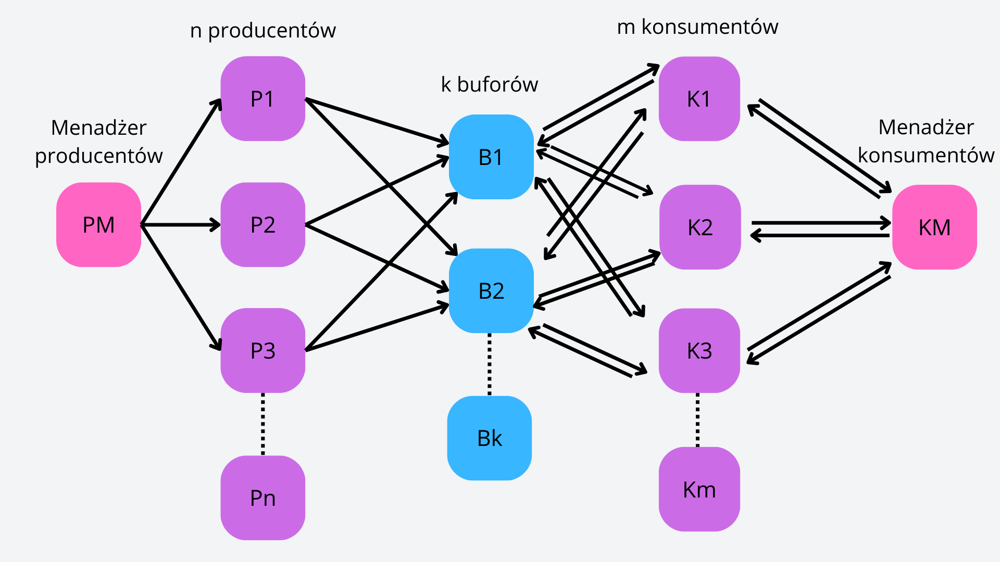

# Producer-Consumer Problem with Distributed Buffer using JCSP
This project implements the Producer-Consumer problem with a distributed buffer using JCSP (Java Communicating Sequential Processes). It demonstrates how multiple producers and consumers interact with a shared buffer in a multi-threaded, distributed system environment.

Project implement this diagram:

## Technologies Used
 - JCSP
 - Java
 - Gradle

## System Requirements
 - Java 17 or later.
 - JCSP library.
